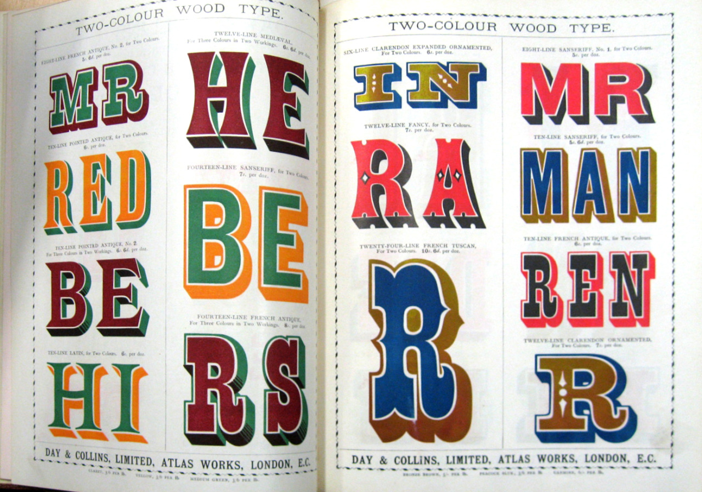
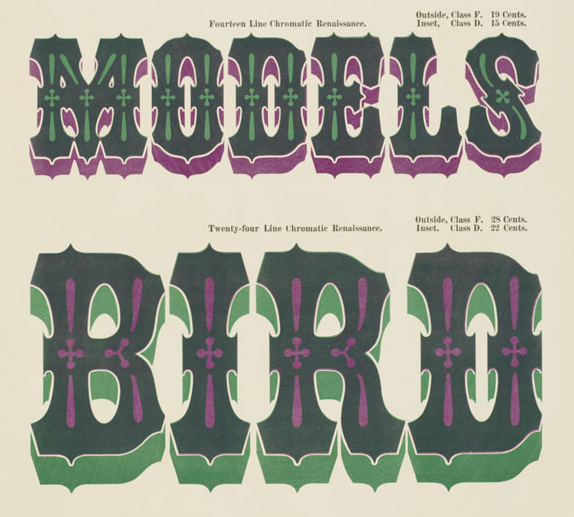
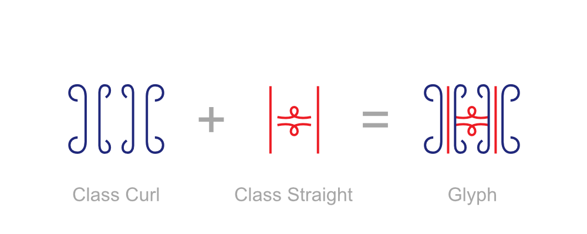
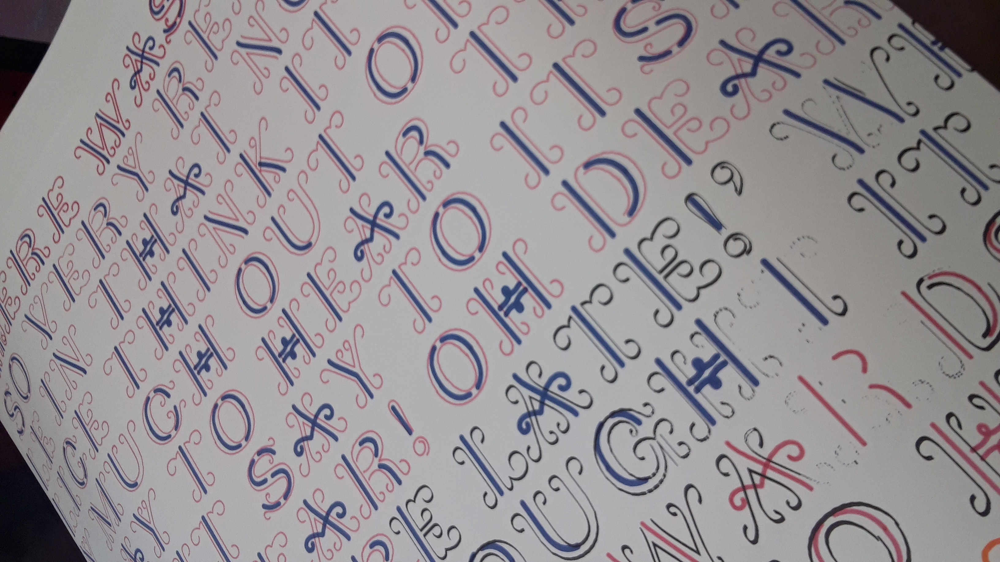
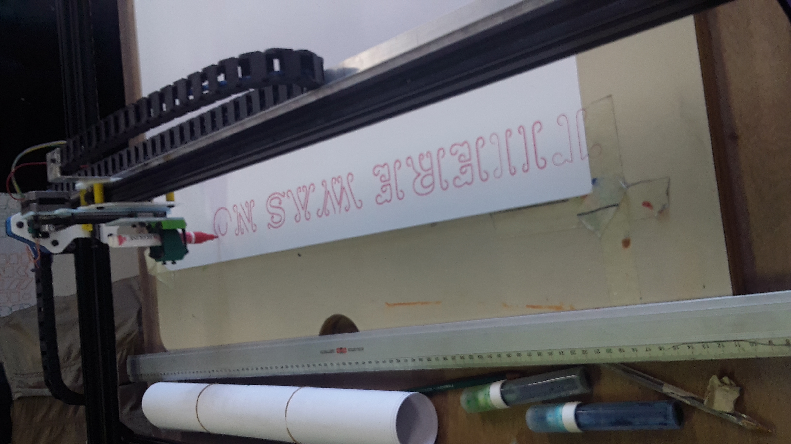

# POLO - Stroke-font

Polo was design by Sebastien Sanfilippo during a workshop run by the Atelier Loop in Brussels (July 7— 8, 2018)

Inspired by the Tuscan designs of the early 20th century wood-type, 
Polo is a stroke font specially designed to work for printing on plotters.

The charater set includes latin capitals and basic punctuation. 

Strokes are not defined by their outlines but by their centre-lines. 

Because OTF or TTF formats do not support open path we had to use the SVG format to keep the paths open.

Each glyph is a separate SVG file named with the hexadecimal value of each letter.

The side bearings are included in the width of every individual SVG file. Unfortunately there is no way of including kerning information in SVG file.

The typeface has 2 layers defined by classes (Curl & Straight)
You can access these classes via CSS in order to activate or deactivate the layers.

 

[Demo online](http://www.luuse.io/workshop/summerloop/Polo-stroke-font/)

## Licence

Under [GPLv3](https://www.gnu.org/licenses/quick-guide-gplv3.html).
